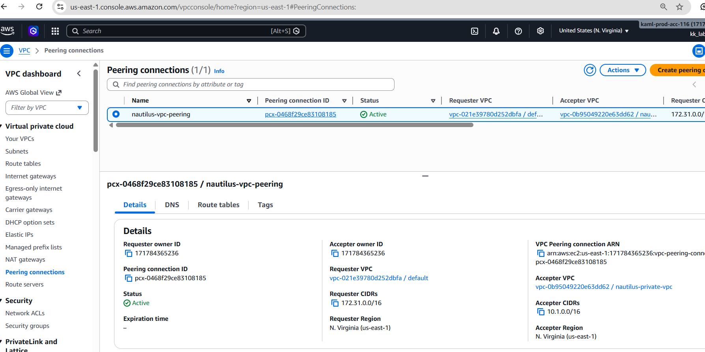
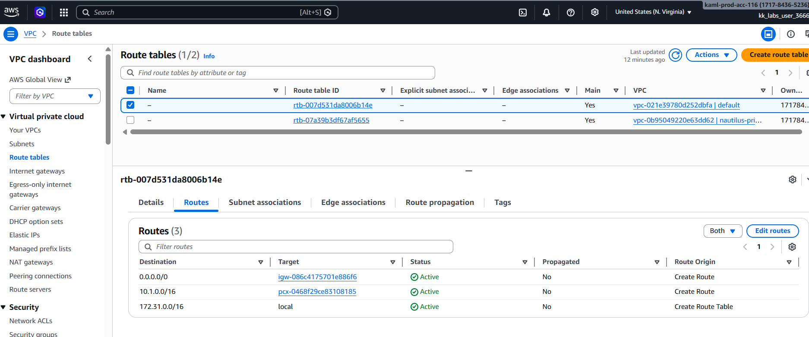
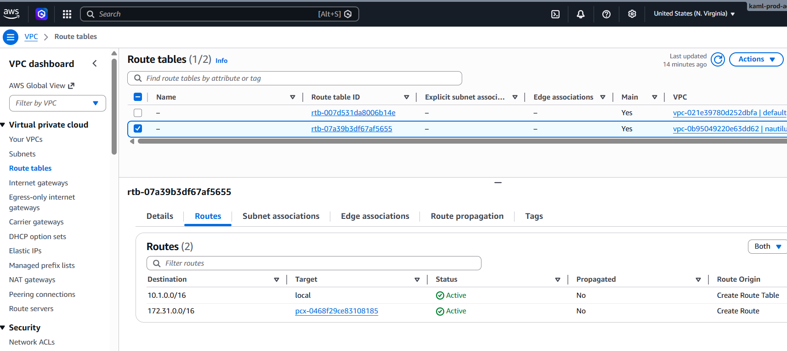
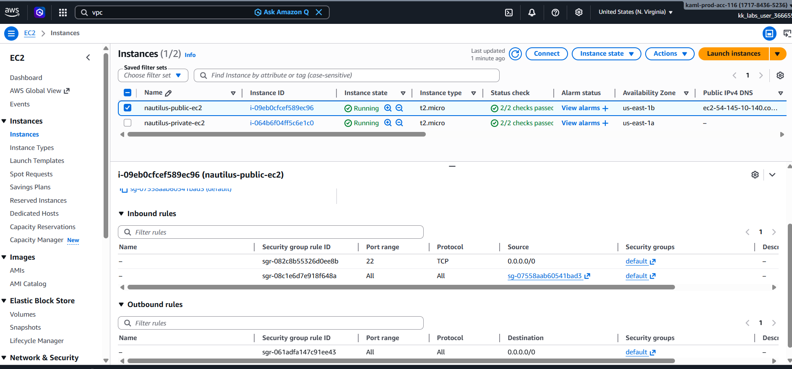
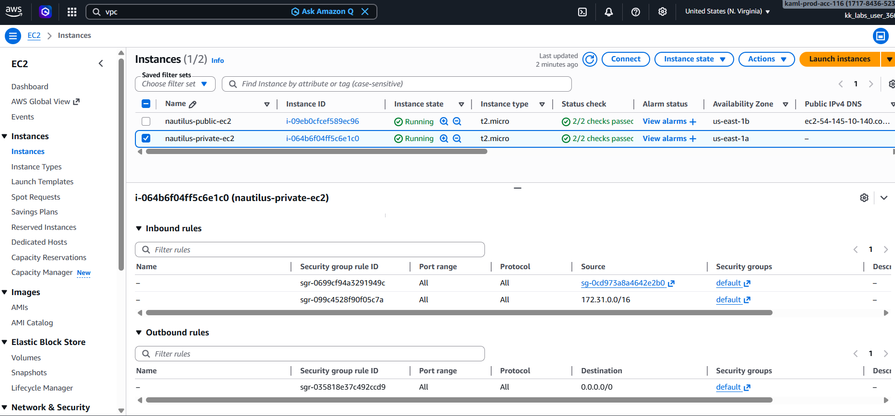
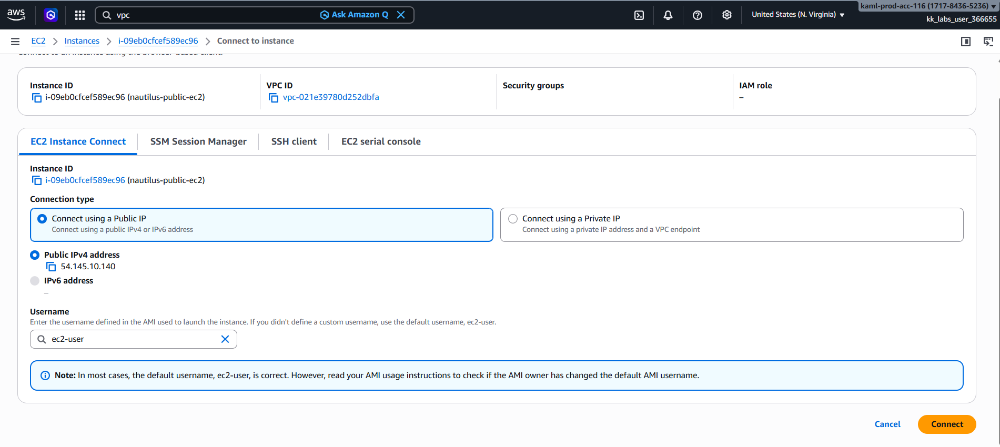

## Day 29: Establishing Secure Communication Between Public and Private VPCs via VPC Peering

### 🎯 Task:
The Nautilus DevOps team has been tasked with demonstrating the use of VPC Peering to enable communication between two VPCs. One VPC will be a private VPC that contains a private EC2 instance, while the other will be the default public VPC containing a publicly accessible EC2 instance.

1) There is already an existing EC2 instance in the public vpc/subnet:`datacenter-public-ec2`
2) Private VPC: `datacenter-private-vpc` CIDR: 10.1.0.0/16
3) Subnet in datacenter-private-vpc: `datacenter-private-subnet` CIDR: 10.1.1.0/24
4) EC2 instance in the private subnet: `datacenter-private-ec2`
5) Create a Peering Connection between the Default VPC and the Private VPC:
VPC Peering Connection `datacenter-vpc-peering`

6) Configure Route Tables to enable communication between the two VPCs.
Ensure the private EC2 instance is accessible from the public EC2 instance.
7) Test the Connection:

Add /root/.ssh/id_rsa.pub public key to the public EC2 instance's ec2-user's authorized_keys to make sure we are able to ssh into this instance from AWS client host. You may also need to update the security group of the private EC2 instance to allow ICMP traffic from the public/default VPC CIDR. This will enable you to ping the private instance from the public instance.
SSH into the public EC2 instance and ensure that you can ping the private EC2 instance.

### Solution
1) Create a peering connection:
```bash
aws ec2 create-vpc-peering-connection --vpc-id <default-vpc-id> --peer-vpc-id <datacenter-private-vpc-id> --tag-specifications 'ResourceType=vpc-peering-connection,Tags=[{Key=Name,Value=datacenter-vpc-peering}]'
```



2) Configure route tables:
- For the default VPC route table, add a route to the private VPC CIDR (10.1.0.0/16):
```bash
aws ec2 create-route --route-table-id <default-vpc-route-table-id> --destination-cidr-block 10.1.0.0/16 --vpc-peering-connection-id <datacenter-vpc-peering-id>
```


- For the private VPC route table, add a route to the default VPC CIDR (`<default-vpc-cidr>`):
```bash
aws ec2 create-route --route-table-id <datacenter-private-vpc-route-table-id> --destination-cidr-block <default-vpc-cidr> --vpc-peering-connection-id <datacenter-vpc-peering-id> || aws ec2 replace-route --route-table-id <datacenter-private-vpc-route-table-id> --destination-cidr-block <default-vpc-cidr> --vpc-peering-connection-id <datacenter-vpc-peering-id>
```

3) Update security groups:
- Update the security group of the private EC2 instance to allow ICMP traffic from the default VPC CIDR (`<default-vpc-cidr>`):
```bash
aws ec2 authorize-security-group-ingress --group-id <private-ec2-security-group-id> --protocol icmp --port -1 --cidr <default-vpc-cidr>
```


Private EC2 instance should now allow ICMP traffic from the public/default VPC, enabling ping tests from the public EC2 instance.


4) Test the connection:



- copy content of .ssh/id_rsa.pub to the public EC2 instance's authorized_keys:
```bash
ssh-copy-id -i ~/.ssh/id_rsa.pub ec2-user@<public-ec2-instance-public-ip>
```
- SSH into the public EC2 instance:
```bash
ssh ec2-user@<public-ec2-instance-public-ip>
```
- Ping the private EC2 from the public instance:
```bash
ping <private-ec2-instance-private-ip>
```