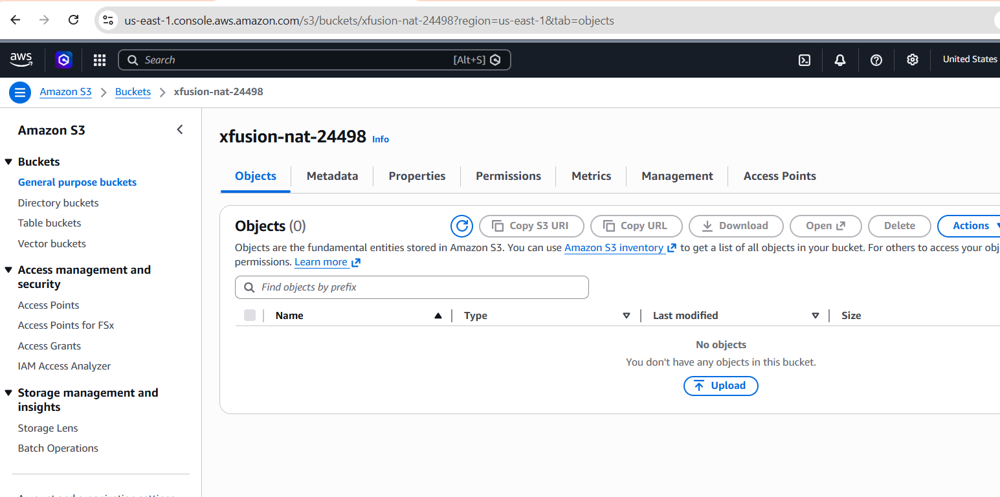
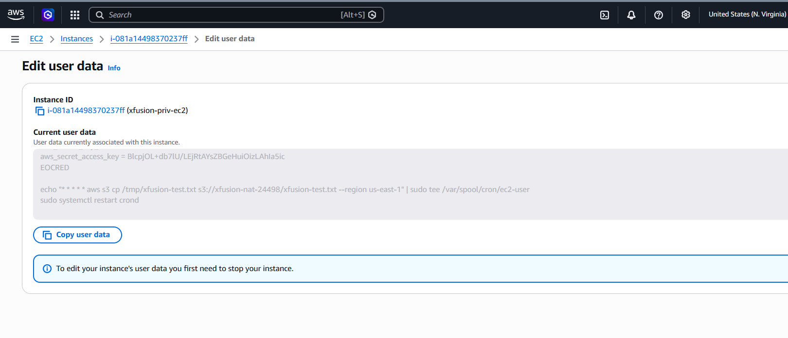
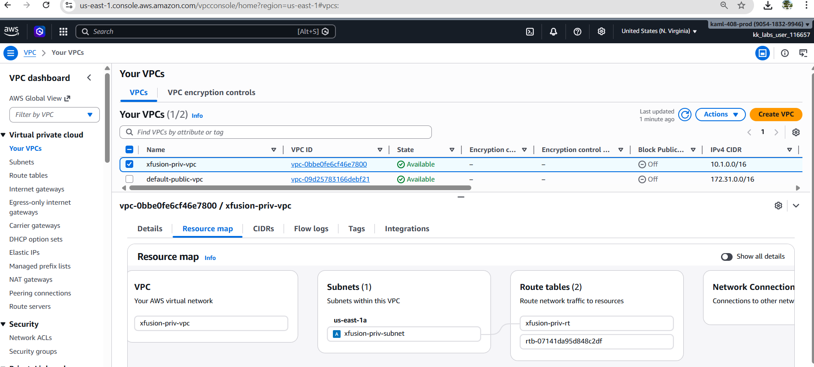
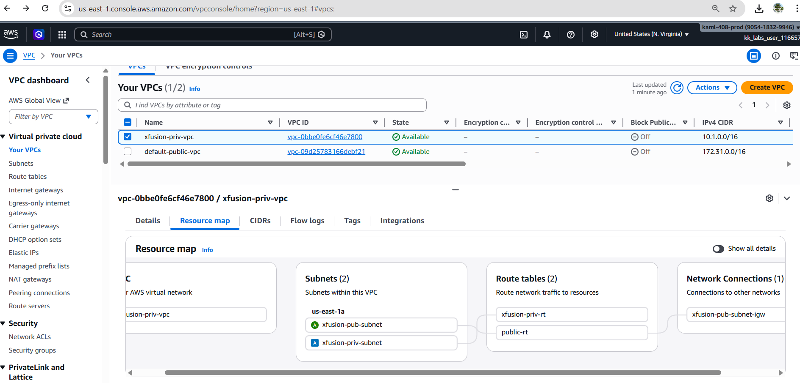
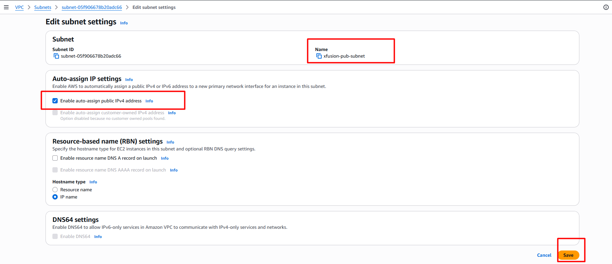
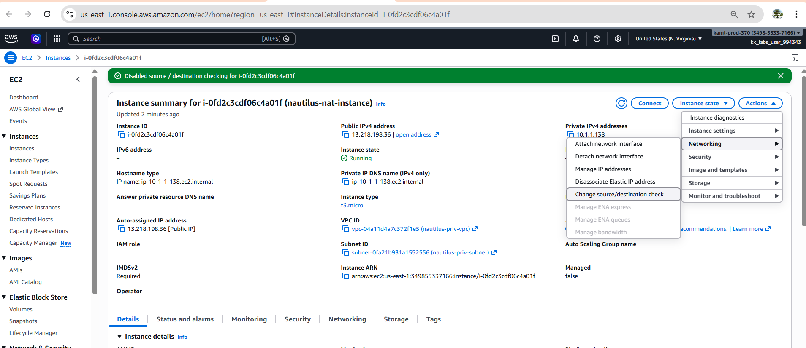
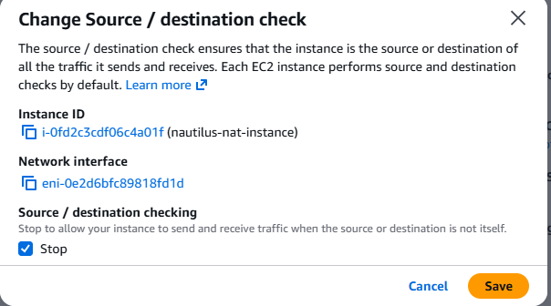
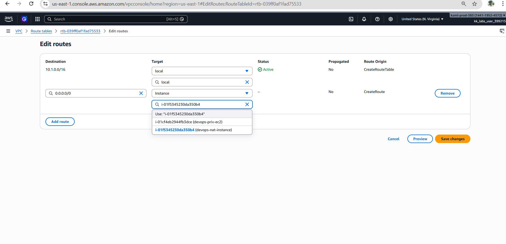

# Day 30: Enable Internet Access for Private EC2 using NAT Instance

## 🎯 Objective
The Nautilus DevOps team is tasked with enabling internet access for an EC2 instance running in a private subnet. This instance should be able to upload a test file to a public S3 bucket once it can access the internet. To minimize costs, the team has decided to use a NAT Instance instead of a NAT Gateway.

The following components already exist in the environment:
1) A VPC named xfusion-priv-vpc and a private subnet named xfusion-priv-subnet have been created.
2) An EC2 instance named xfusion-priv-ec2 is already running in the private subnet.
3) The EC2 instance is configured with a cron job that uploads a test file to the S3 bucket xfusion-nat-24498 every minute. Upload will only succeed once internet access is established.

Your task is to:

- Create a new public subnet named xfusion-pub-subnet in the existing VPC.
- Launch a NAT Instance in the public subnet using an Amazon Linux 2023 AMI and name it xfusion-nat-instance.
-  Configure this instance to act as a NAT instance. Make sure to use a custom security group for this instance.
After the configuration, verify that the test file xfusion-test.txt appears in the S3 bucket xfusion-nat-24498. This indicates successful internet access from the private EC2 instance via the NAT Instance.

Note: iptables is not installed by default on Amazon Linux 2023. You will need to install and enable it before configuring NAT setup.
## 📌 Key Considerations


## 
```bash
#!/bin/bash
echo "xfusion Test File" > /tmp/xfusion-test.txt

mkdir -p /home/ec2-user/.aws
cat <<EOCRED > /home/ec2-user/.aws/credentials
[default]
aws_access_key_id = 
aws_secret_access_key = 
EOCRED

echo "* * * * * aws s3 cp /tmp/xfusion-test.txt s3://xfusion-nat-24498/xfusion-test.txt --region us-east-1" | sudo tee /var/spool/cron/ec2-user
sudo systemctl restart crond
```
## 🛠️ Steps to Implement

1. **Create a Public Subnet**:
* Created a subnet named devops-pub-subnet
* Associated it with:
The existing VPC devops-priv-vpc
Enabled:
Auto-assign public IPv4 addresses
Associated the subnet with a route table that has:
0.0.0.0/0 → Internet Gateway   
- Select the existing VPC (xfusion-priv-vpc) and create a new subnet named xfusion-pub-subnet.



after creating the public subnet, ensure that it is associated with an appropriate route table that has a route to an internet gateway, allowing instances in this subnet to access the internet.



check Auto-assign Public IP settings for the public subnet to ensure that instances launched in this subnet receive a public IP address.



2. **Launch a NAT Instance**:
   - Use the Amazon Linux 2023 AMI to launch a new EC2 instance in the xfusion-pub-subnet.
   - Name the instance xfusion-nat-instance.
   - Assign a public IP address to the instance.
    - Create and attach a custom security group that allows necessary inbound and outbound traffic for NAT functionality.





3. **Configure the NAT Instance**:
    - Connect to the xfusion-nat-instance via SSH.
    - Install iptables using the package manager.
    - Enable IP forwarding on the instance.
    - Configure iptables to allow traffic from the private subnet to access the internet through the NAT instance.

```bash
sudo sysctl net.ipv4.ip_forward   ## tells the Linux kernel whether it is allowed to forward packets between network interfaces.
## output
net.ipv4.ip_forward = 0   NAT will NOT work

## Enableing NAT forwarding
sudo sysctl -w net.ipv4.ip_forward=1
## output
net.ipv4.ip_forward = 1   NAT CAN work

## iptables entry

sudo iptables -t nat -A POSTROUTING -o eth0 -j MASQUERADE

## installed the iptables service

sudo yum install -y iptables-services

# saved the rule 
sudo service iptables save

sudo systemctl enable iptables --now

sudo systemctl status iptables

sudo iptables -t nat -L -n -v
```



4. **Verify Internet Access**:
    - Monitor the S3 bucket (xfusion-nat-24498) for the presence of the test file (xfusion-test.txt).