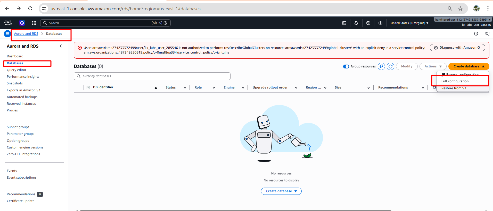
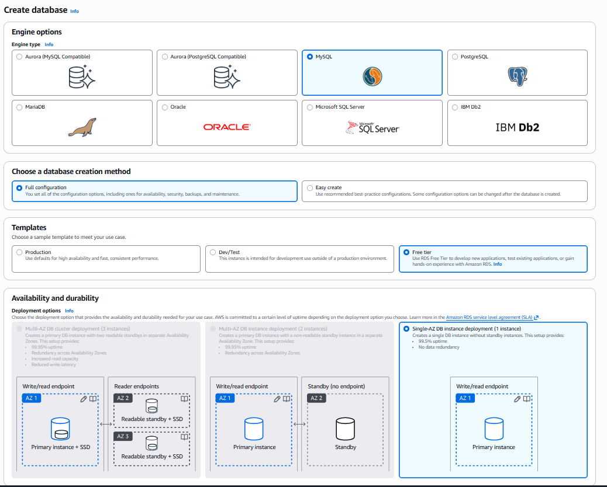
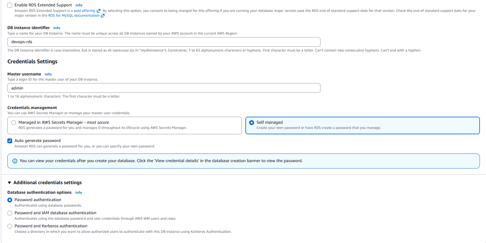
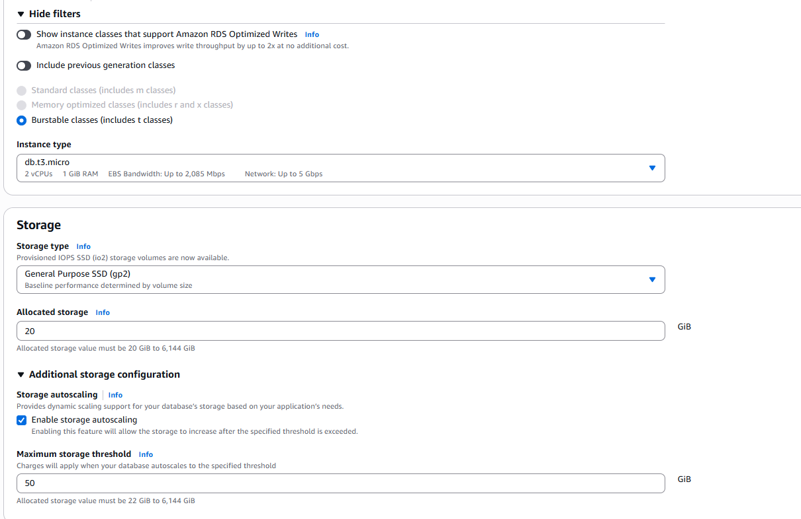

# Day 31: Configuring a Private RDS Instance for Application Development

## 🎯 As a member of the Nautilus DevOps Team, your task is to perform the following:
Provision a Private RDS Instance: 
Create a new private RDS instance named `devops-rds` using a sandbox template, 
further it must be a `db.t3.micro` type instance.
Engine Configuration: Use the `MySQL` engine with version `8.4.x`.
Enable Storage Autoscaling: Enable storage autoscaling and set the threshold value to `50GB`. Keep the rest of the configurations as default.

## 📝 Steps to create a Private RDS Instance:

1) Search for the RDS service in the AWS Management Console.
2) Click on "Create database" and select the "Standard Create" option.
3) Choose "MySQL" as the database engine and select version 8.4.x
4) Under "Templates", select the "Free tier" option.
5) In the "Settings" section, set the DB instance identifier to `devops-rds` and choose a master username and password.
6) In the "DB instance size" section, select the `db.t3.micro` instance type.
7) In the "Storage" section, enable storage autoscaling and set the threshold value to `50GB`.
8) Keep the rest of the configurations as default and click on "Create database" to provision the RDS instance.

