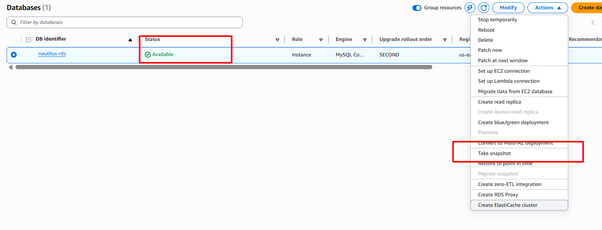
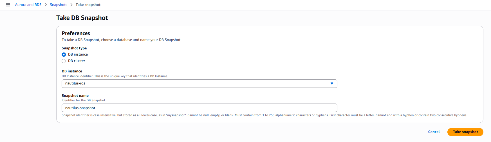
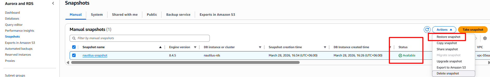
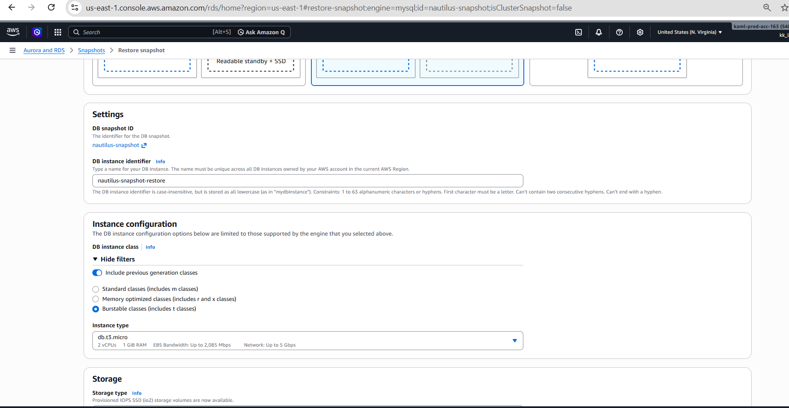

# Day 32: Snapshot and Restoration of an RDS Instance

## 🎯 task
As a member of the Nautilus DevOps Team, your task is to perform the following:

1. Take a Snapshot: Take a snapshot of the `nautilus-rds` RDS instance and name it `nautilus-snapshot` (please wait for the `nautilus-rds` instance to be in the available state).

2. Restore the Snapshot: Restore the snapshot to a new RDS instance named `nautilus-snapshot-restore`.

3. Configure the New RDS Instance: Ensure that the new RDS instance has a class of `db.t3.micro`.

4. Verify the New RDS Instance: The new RDS instance must be in the Available state upon completion of the restoration process.

## 🎯 Task Objective

Perform the following actions:

### Snapshot
- Source RDS instance → `nautilus-rds`
- Snapshot name → `nautilus-snapshot`
- Precondition → Instance must be in Available state

### Restore
- New RDS instance name → `nautilus-snapshot-restore`
- Instance class → `db.t3.micro`
- Final state → Available

## 🧭 Step-by-Step Guide (AWS Console)

### Step 1: Ensure Source RDS Is Available ✅

1. Go to **RDS → Databases**
2. Select `nautilus-rds`
3. Confirm status shows **Available**

⏱️ *This may take a few minutes.*

### Step 2: Take RDS Snapshot 📸

1. Select `nautilus-rds` instance
2. Click **Actions → Take snapshot**
3. Enter snapshot name: `nautilus-snapshot`
4. Click **Take snapshot**

⏱️ *This may take a few minutes.*

### Step 3: Restore Snapshot to New RDS Instance 🔄

1. Select snapshot `nautilus-snapshot`
2. Click **Actions → Restore snapshot**
3. The restore configuration form will open

### Step 4: Configure Restored Instance ⚙️

Set the following parameters:

- **DB instance identifier:** `nautilus-snapshot-restore`
- **DB instance class:** `db.t3.micro`
- Keep all other settings as default
- **Public access:** No
- **Storage & engine:** Inherited from snapshot

⏱️ *Restore may take 5–10 minutes*

## 🧪 Final Verification Checklist ✓

Once restoration completes, verify:

- ✔ New instance name → `nautilus-snapshot-restore`
- ✔ Instance class → `db.t3.micro`
- ✔ Engine → Same as source
- ✔ Status → Available

**🎉 Snapshot restore successful!**