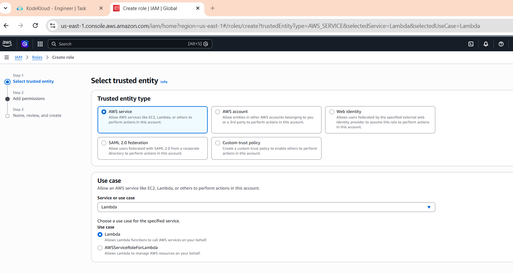
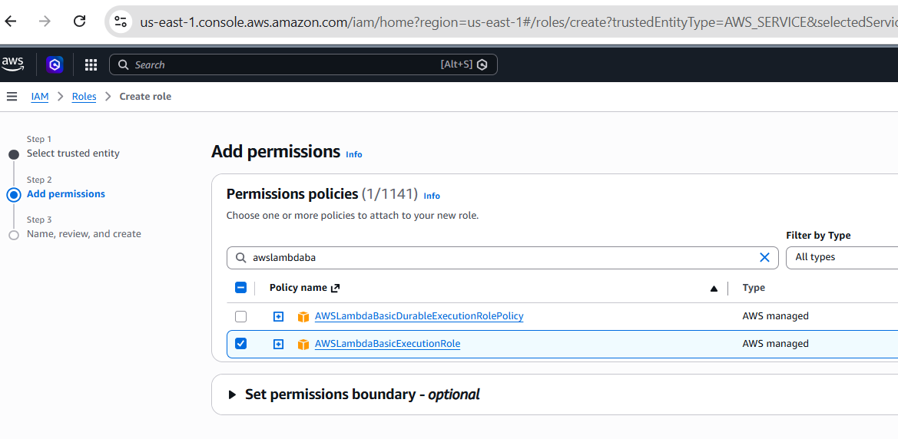
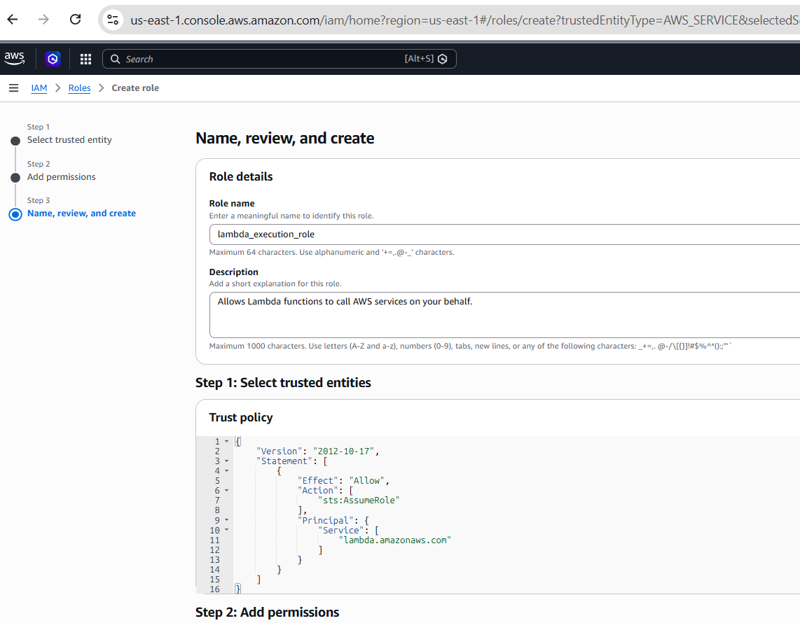
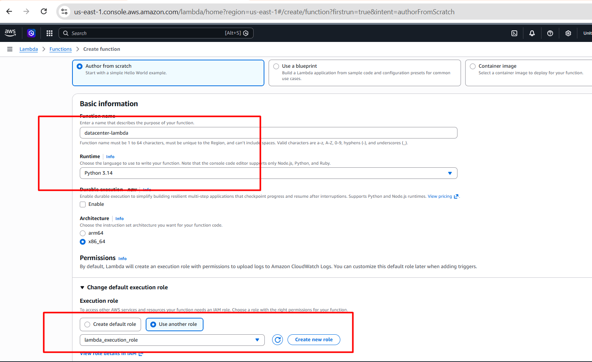
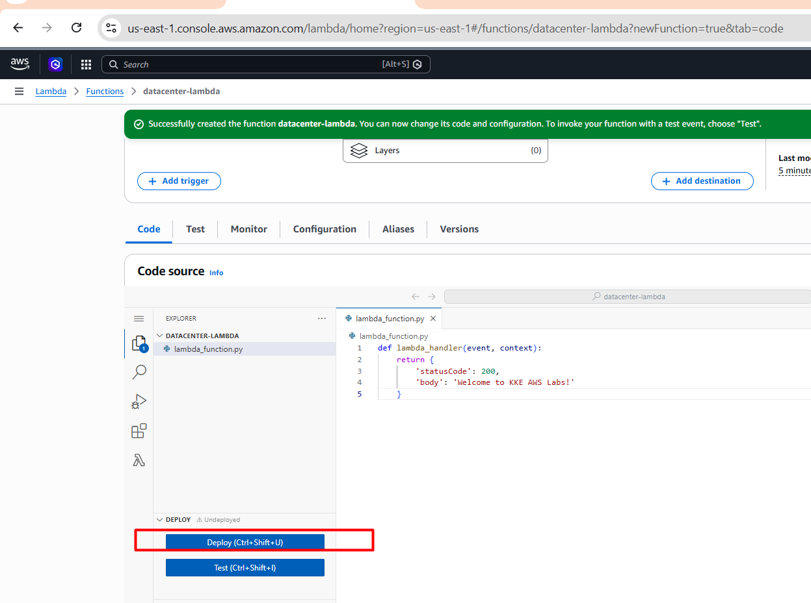

# Day 33: Create a Lambda Function

## 🎯 Objective
The Nautilus DevOps team is embracing serverless architecture by integrating AWS Lambda into their operational tasks. They have decided to deploy a simple Lambda function that will return a custom greeting to demonstrate serverless capabilities effectively. This function is crucial for showcasing rapid deployment and easy scalability features of AWS Lambda to the team.

- Create Lambda Function: Create a Lambda function named `datacenter-lambda`.
- Runtime: Use the Runtime Python.
- Deploy: The function should print the body `Welcome to KKE AWS Labs!`.
- Status Code: Ensure the status code is 200.
- IAM Role: Create and use the IAM role named `lambda_execution_role`.

## 🛠️ Steps to Create the Lambda Function
1. **Create IAM Role**:
   - Go to the AWS Management Console.
   - Navigate to the IAM service.
   - Create a new role named `lambda_execution_role`.
   - Select AWS Lambda as the trusted entity.
   - Attach the necessary permissions (e.g., AWSLambdaBasicExecutionRole).

   

   

   

2. **Create Lambda Function**:
    - Go to the AWS Lambda service in the AWS Management Console.
    - Choose "Author from scratch".
    - Enter the function name `datacenter-lambda`.
    - Select the runtime as Python.
    - Choose the IAM role named `lambda_execution_role`.
    - Click on "Create function".

    

3. **Add Function Code**:
   - In the function code editor, replace the default code with the following Python code:

```python
def lambda_handler(event, context):
    return {
        'statusCode': 200,
        'body': 'Welcome to KKE AWS Labs!'
    }
```
- Click on "Deploy" to save the changes.
- Click on "Test" to create a test event and execute the function to verify it returns the expected output.


