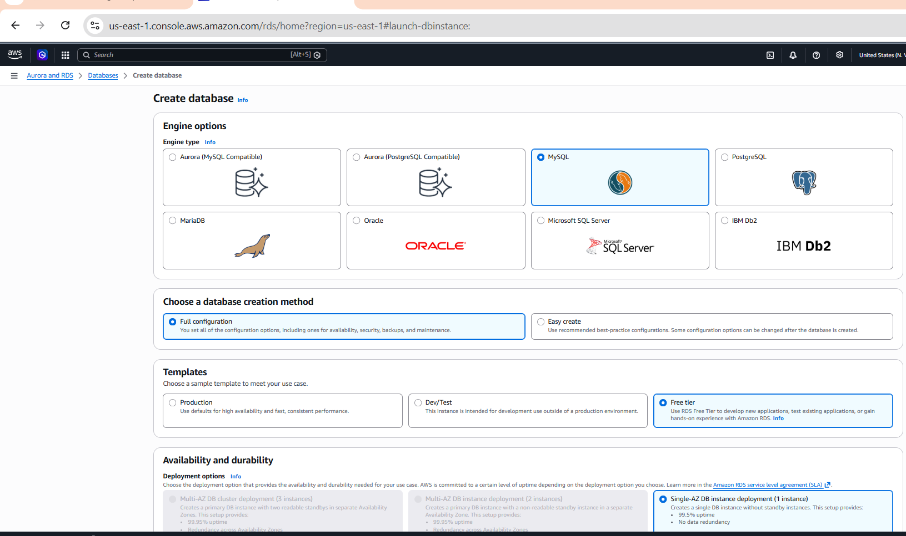
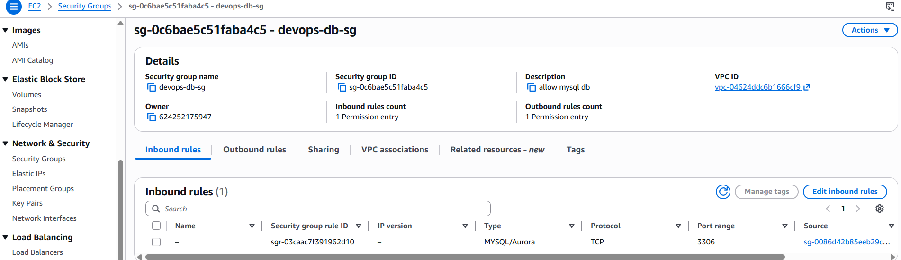
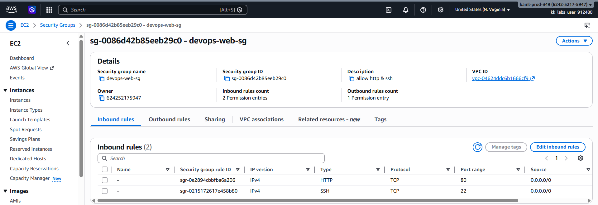
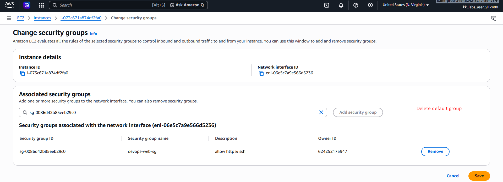

# Day 35: Deploying and Managing Applications on AWS

## 🎯 Objective
The Nautilus DevOps team needs a new private RDS instance for their application. They need to set up a MySQL database and ensure that their existing EC2 instance can connect to it. This will help in managing their database needs efficiently and securely.

1) Task Details:
Create a private RDS instance named `nautilus-rds` using a sandbox template.
The engine type must be `MySQL v8.4.5`, and it must be a `db.t3.micro` type instance.
The master username must be `nautilus_admin` with an appropriate password.
The RDS storage type must be `gp2`, and the storage size must be `5GiB`.
Create a database named `nautilus_db`.
Keep the rest of the configurations as default. Ensure the instance is in available state.
Adjust the security groups so that the `nautilus-ec2` instance can connect to the RDS on port 3306 and also open port 80 for the instance.

2) An EC2 instance named `nautilus-ec2` exists. Connect to this instance from the AWS console. Create an SSH key (/root/.ssh/id_rsa) on the aws-client host if it doesn't already exist. Add the public key to the authorized keys of the root user on the EC2 instance for password-less SSH access.

3) There is a file named index.php under the /root directory on the aws-client host. Copy this file to the `nautilus-ec2` instance under the /var/www/html/ directory. Make the appropriate changes in the file to connect to the RDS.

4) You should see a Connected successfully message in the browser once you access the instance using the public IP.

## 🛠️ Steps to Achieve the Objective

1. **Create a Private RDS Instance**:
   - Navigate to the AWS Management Console and go to the RDS service.
   - Click on "Create database" and select the "Standard Create" option.
   - Choose `MySQL` as the engine type and select version `8.4.5`.
   - Select the `db.t3.micro` instance type.
   - Set the master username to `nautilus_admin` and create a strong password.
   - Choose `gp2` for storage type and set the storage size to `5GiB`.
   - Create a database named `nautilus_db`.
   - Keep the rest of the configurations as default and launch the instance.

2. **Configure Security Groups**:
   - Go to the EC2 service and find the security group associated with the `nautilus-ec2` instance.
   - Edit the inbound rules to allow traffic on port 3306 for MySQL and port 80 for HTTP.

3. **Connect to EC2 Instance**:
    - Use the AWS console to connect to the `nautilus-ec2` instance via SSH.
    - If you don't have an SSH key, create one on the aws-client host and add the public key to the authorized keys of the root user on the EC2 instance.

4. **Copy index.php to EC2 Instance**:
    - Use SCP or any file transfer method to copy the index.php file from the aws-client host to the /var/www/html/ directory on the `nautilus-ec2` instance.
    - Edit the index.php file to include the connection details for the RDS instance (hostname, username, password, and database name).

5. **Access the Application**:
    - Open a web browser and navigate to the public IP address of the `nautilus-ec2` instance.
    - You should see a "Connected successfully".

