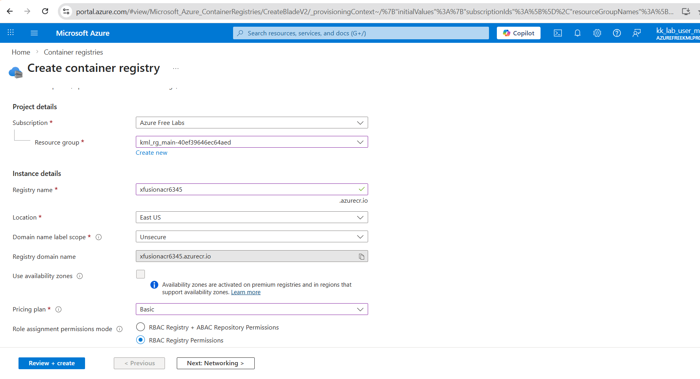
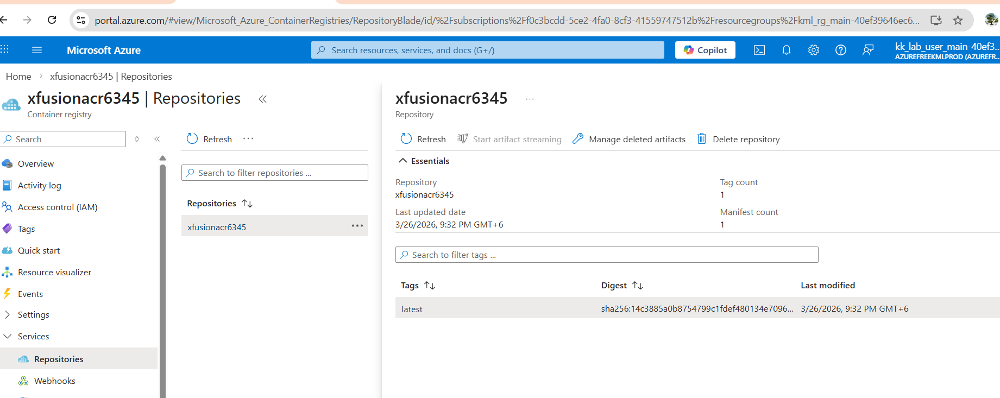

# Day 29: Working with Azure Container Registry (ACR)

## 🎯 Objective
The Nautilus DevOps team has been tasked with setting up a containerized application. They need to create a Azure Container Registry (ACR) to store their Docker images. Once the repository is created, they will build a Docker image from a Dockerfile located on the azure-client host and push this image to the ACR repository. This process is essential for maintaining and deploying containerized applications in a streamlined manner.

1) Create a ACR repository named xfusionacr6345 under East US.

2) Pricing plan must be Basic.

3) Dockerfile already exists under /root/pyapp directory on azure-client host.

4) Build a Docker image using this Dockerfile and push the same to the newly created ACR repo. The image tag must be latest i.e xfusionacr6345:latest.


## 🛠️ Steps to Achieve the Objective

### Step 1: Create ACR Repository
1. Search "Container Registries" and click on "Create".
2. Fill in the required details:
    - Registry Name: xfusionacr6345
    - Location: East US
    - SKU: Basic



### Step 2: Build and Push Docker Image
1. SSH into the azure-client host where the Dockerfile is located.
2. Log in to the ACR using the Azure CLI:
```bash
az acr login --name xfusionacr6345
```
3. Build the Docker image using the Dockerfile:
```bash
docker build -t xfusionacr6345:latest /root/pyapp
```
4. Tag the Docker image for the ACR repository:
```bash
docker tag xfusionacr6345:latest xfusionacr6345.azurecr.io/xfusionacr6345:latest
```
5. Push the Docker image to the ACR repository:
```bash
docker push xfusionacr6345.azurecr.io/xfusionacr6345:latest
```
