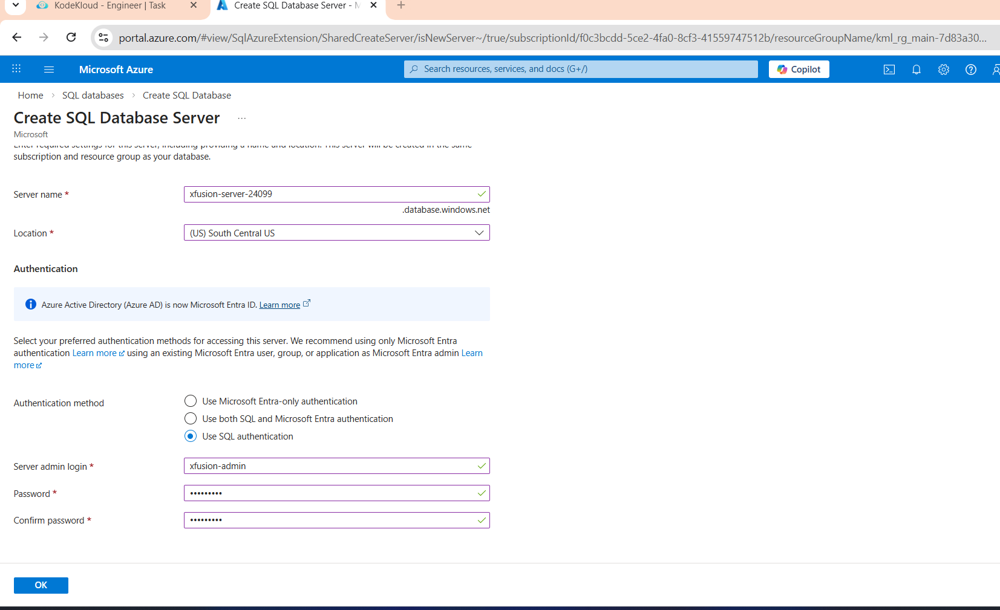
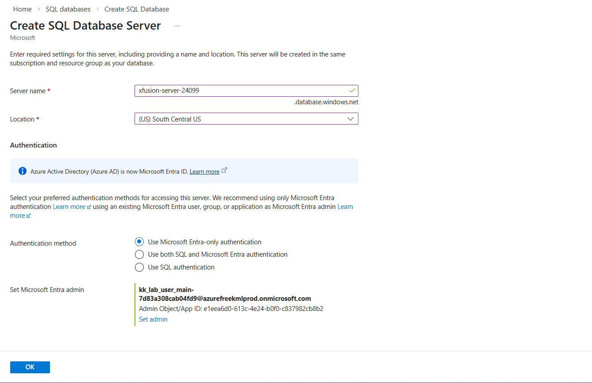
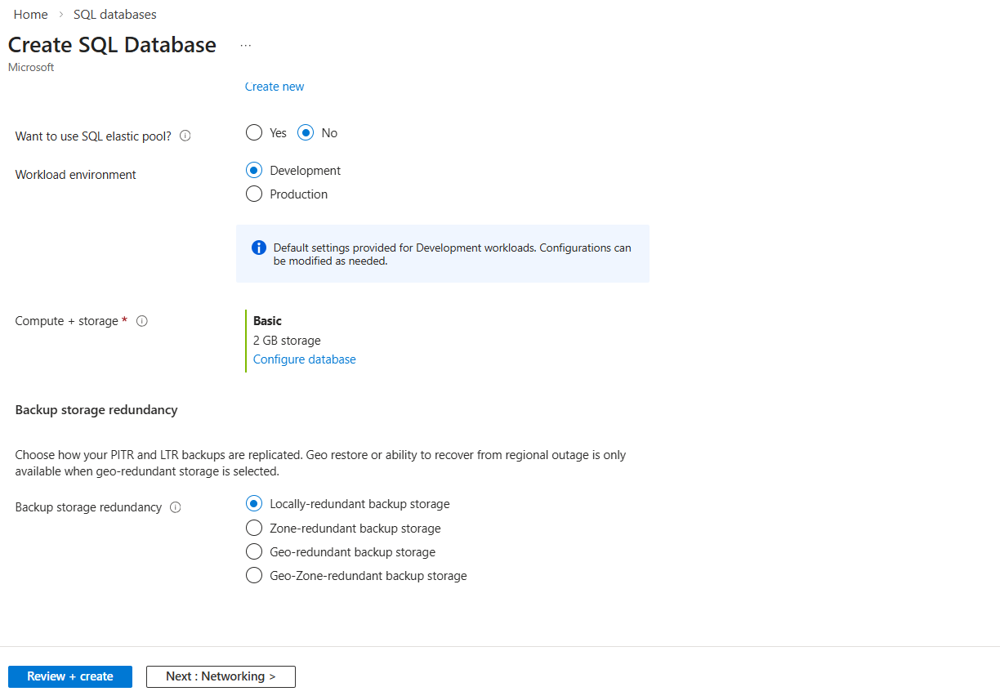

# Day 30: Create Azure SQL Database

## 🎯 create one publicly accessible Azure SQL Database instance along with the following details:

1) The name of the Azure SQL Database must be xfusion-sqldb.

2) The server name must be xfusion-server-24099 under southcentralus.

3) The compute + storage configuration should be Basic (For less demanding workloads).

4) The backup storage redundancy should be Locally-redundant backup storage.

5) Set the login admin username to xfusion-admin and set an appropriate password.

6) Set the database size to 2 GiB.

7) Keep the rest of the configurations as default. Finally, make sure the database is in the Ready state before submitting this task.

## 📝 Steps to create Azure SQL Database:

1) Search for "SQL Database". Click on "Create".
2) Fill in the required details:
    - Subscription: Select your subscription.
    - Resource group: Create a new resource group or select an existing one.
    - Database name: xfusion-sqldb
    - Server: Create a new server with the following details:
        - Server name: xfusion-server-24099
        - Server admin login: xfusion-admin
        - Password: Set an appropriate password
        - Location: South Central US

# Db server

3) Under "Compute + storage", select "Basic" for the pricing tier.
4) Under "Backup storage redundancy", select "Locally-redundant backup storage".
5) Set the database size to 2 GiB.
6) Review the configurations and click on "Create" to deploy the Azure SQL Database.
7) Wait for the deployment to complete and ensure that the database is in the "Ready" state before submitting this task.

