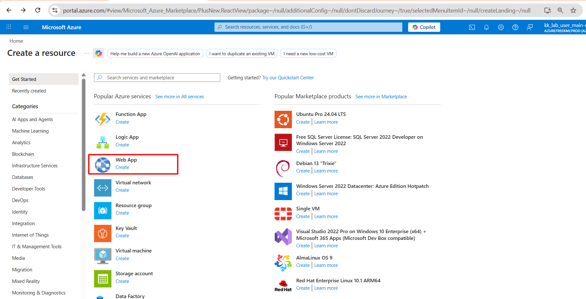
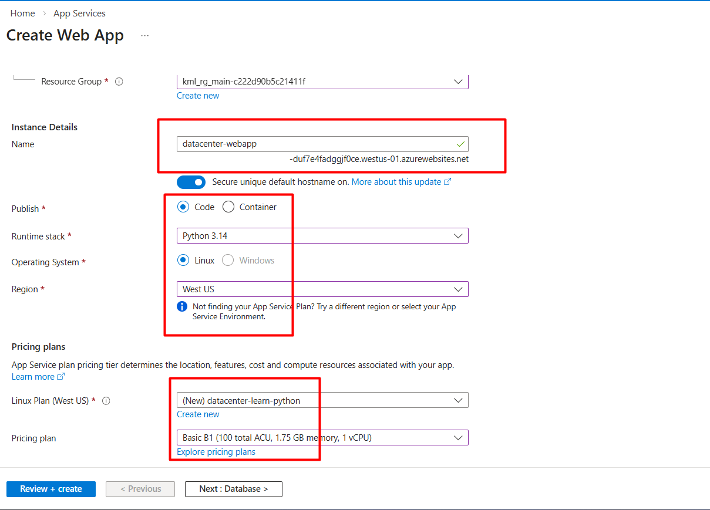
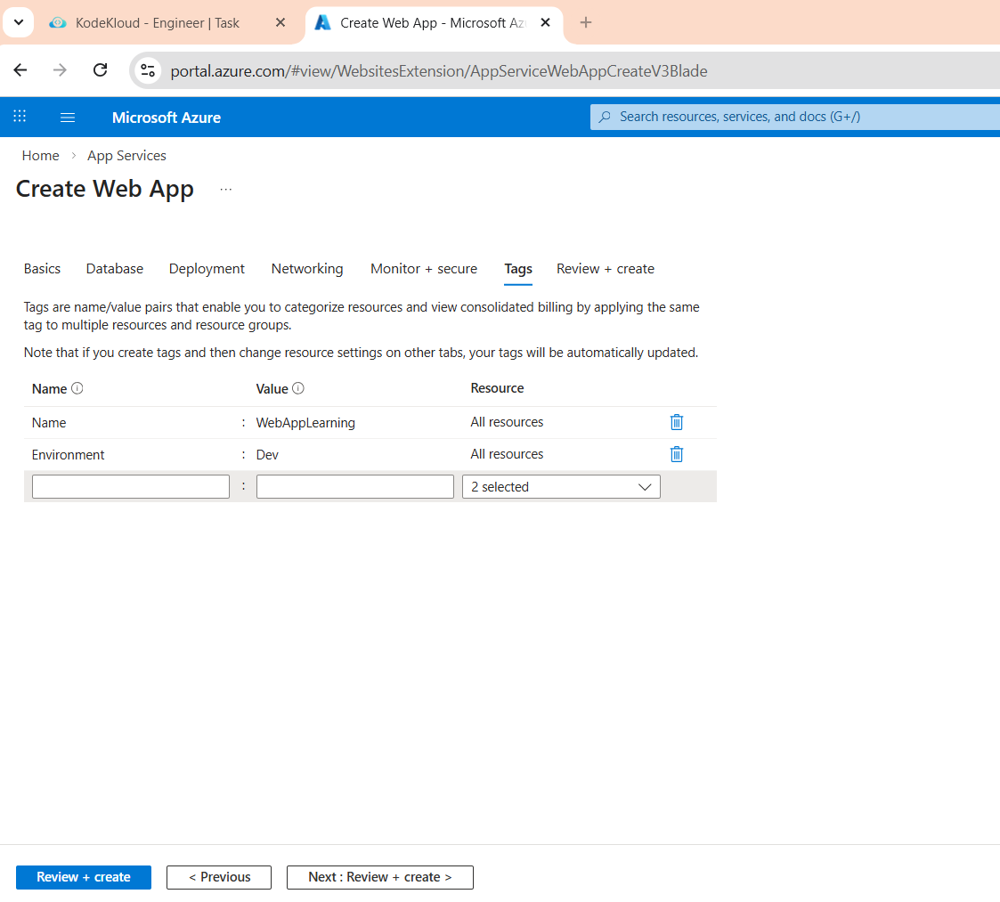
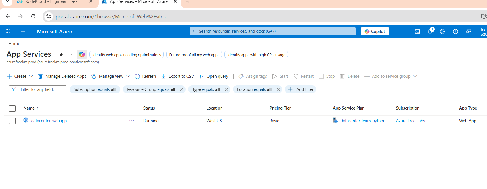

# Day 31: Deploying and Managing a Web Application

## 🎯 Objective
The Nautilus DevOps team is tasked with deploying a Python-based web application on Azure. You need to create a web app using the following specifications:

1) The Web App name should be datacenter-webapp.
2) It should be created in the West US region under the default resource group.
3) The publish option should be set to Code.
4) The Runtime Stack should be Python with Linux as the operating system.
5) Create a new App Service Plan named datacenter-learn-python with the SKU Basic B1.
6) Application Insights should be disabled.
7) Add tags:

Name: WebAppLearning
Environment: Dev

## Solution 

To deploy and manage a web application on Azure, you can follow these steps:
1. **Create a Web App**:
   - Go to the Azure Portal.
   - Click on "Create a resource" and search for "Web App".
   - Click "Create" and fill in the details:
     - Subscription: Select your subscription.
     - Resource Group: Select the default resource group or create a new one.
     - Name: Enter `datacenter-webapp`.
     - Publish: Select "Code".
     - Runtime Stack: Choose "Python 3.x".
     - Operating System: Select "Linux".
     - Region: Choose "West US".
    - Click "Next: Hosting >".

