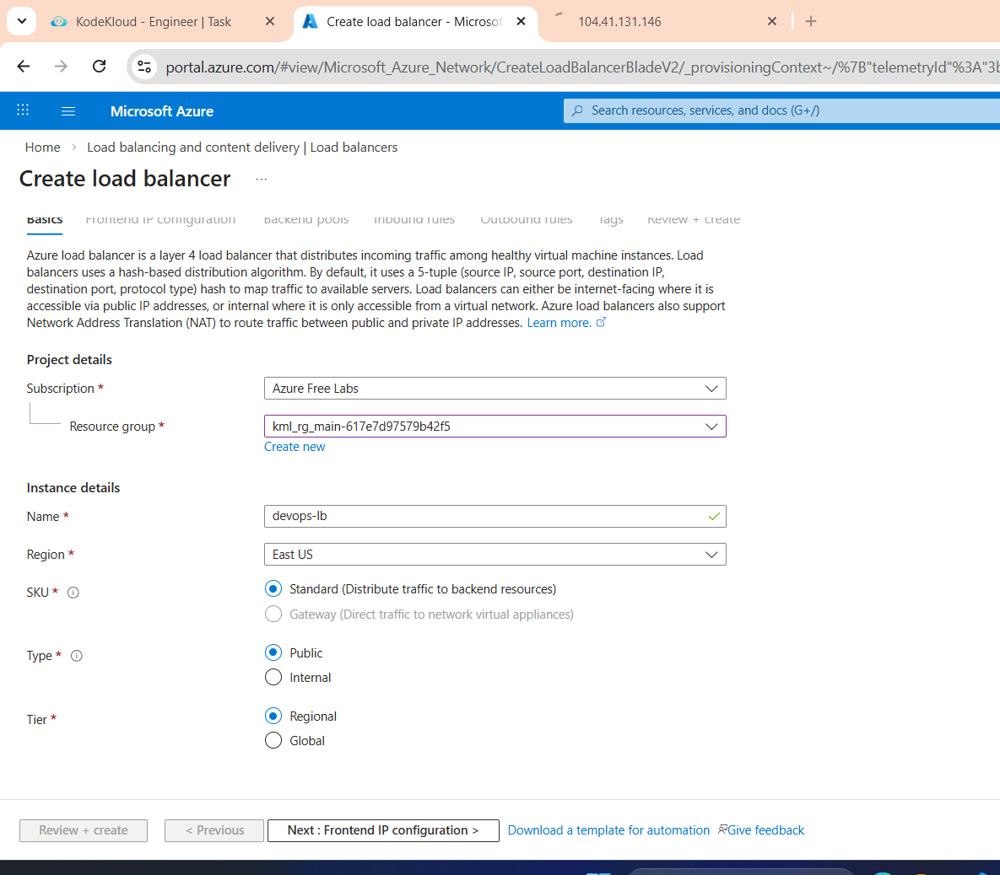
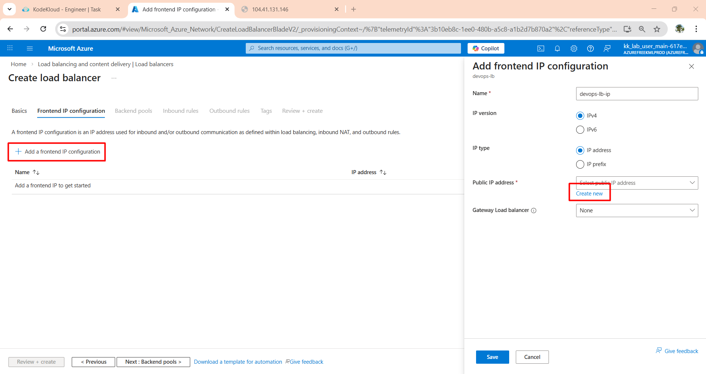
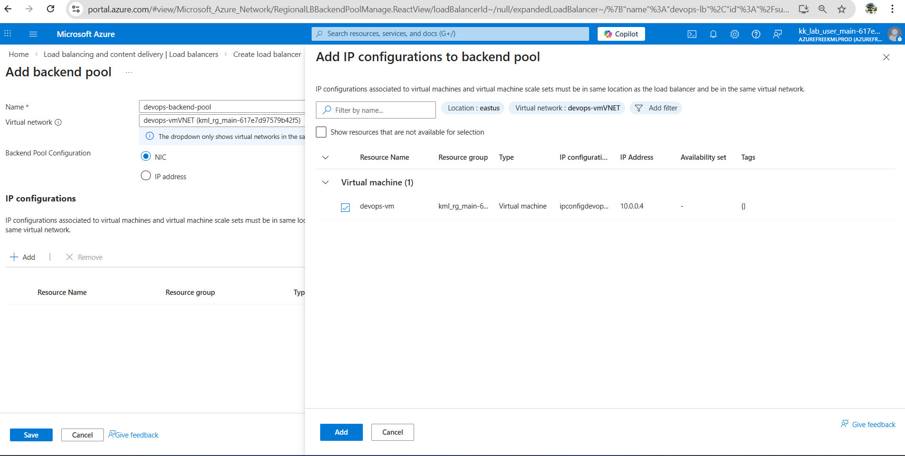
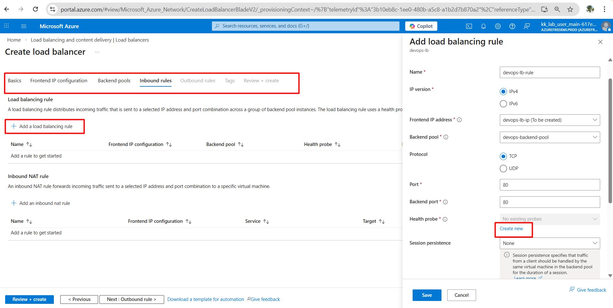
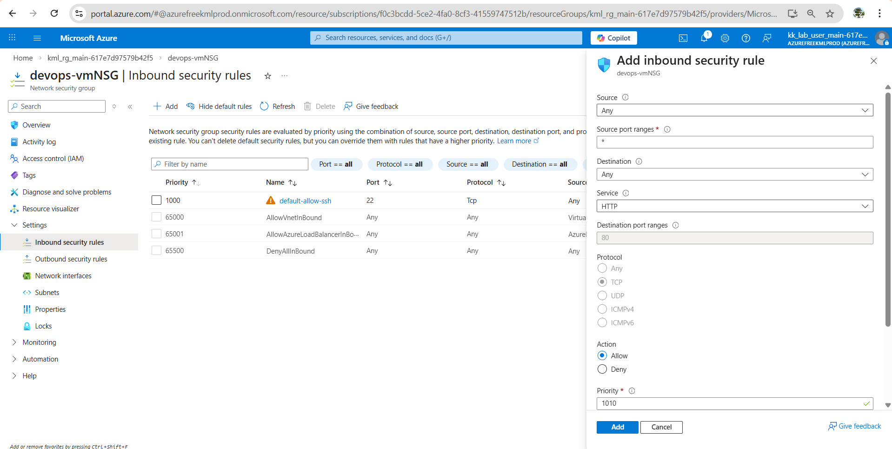
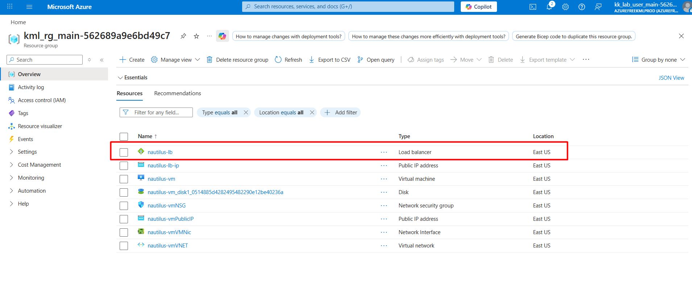
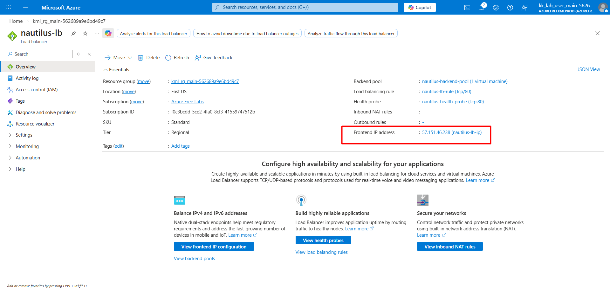
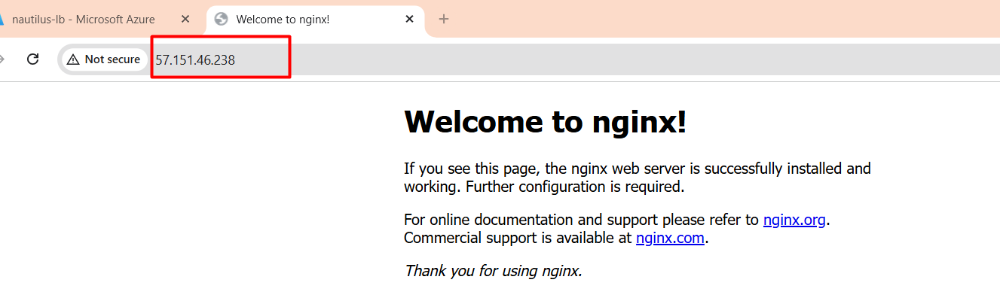

# Day 33: Integrating Virtual Machines with Application Load Balancer

## 🎯 Objective
The Nautilus DevOps team is currently working on setting up a simple application on the Azure cloud. They aim to establish an Azure Load Balancer in front of a Virtual Machine (VM) where an Nginx server is currently running. While the Nginx server currently serves a sample page, the team plans to deploy the actual application later.

- Set up an Azure Load Balancer named devops-lb.
- Configure the Load Balancer’s frontend IP configuration with the name devops-lb-ip and assign a public IP address with the same name (devops-lb-ip).
- Create a backend pool named devops-backend-pool and add the VM running Nginx to this pool.
- Create a health probe named devops-health-probe on port 80 to check the VM's health.
- Set up a load balancer rule named devops-lb-rule to route traffic on port 80 to the backend pool on port 80.
- Add an inbound rule to the existing NSG of the VM to allow HTTP traffic on port 80.

## 🛠️ Steps to Achieve the Objective
1. **Create an Azure Load Balancer**:
   - Navigate to the Azure portal and create a new Load Balancer named `devops-lb`.
   - Choose the appropriate subscription, resource group, and region.

2. **Configure Frontend IP**:
   - In the Load Balancer settings, go to "Frontend IP configurations".
    - Create a new frontend IP configuration named `devops-lb-ip` and associate it with a new public IP address also named `devops-lb-ip`.

3. **Create Backend Pool**:
   - Go to "Backend pools" in the Load Balancer settings.
    - Create a new backend pool named `devops-backend-pool` and add the VM running Nginx to this pool.

4. **Create Health Probe**:
   - Navigate to "Health probes" in the Load Balancer settings.
    - Create a new health probe named `devops-health-probe` that checks the health of the VM on port 80.
5. **Set Up Load Balancer Rule**:
    - Go to "Load balancing rules" in the Load Balancer settings.
    - Create a new load balancing rule named `devops-lb-rule` that routes traffic on port 80 to the backend pool on port 80.

6. **Update NSG Rules**:
    - Navigate to the Network Security Group (NSG) associated with the VM.
    - Add a new inbound security rule to allow HTTP traffic on port 80.
    

## ✅ Expected Outcome

