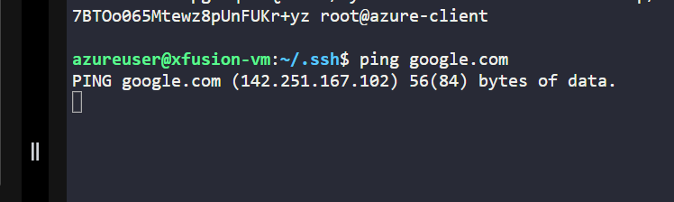
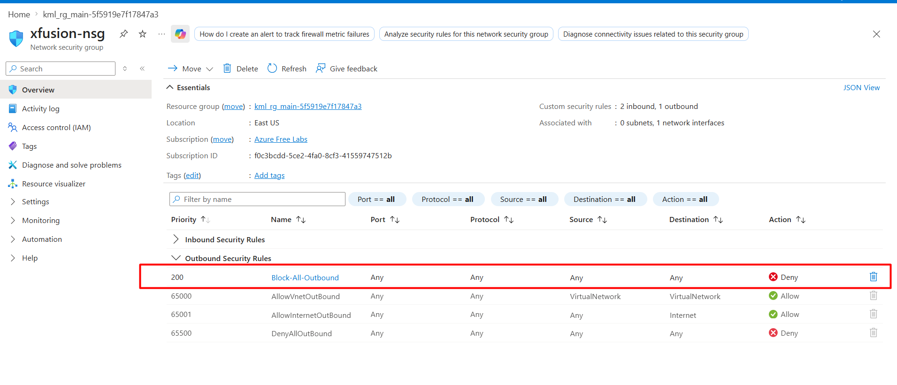
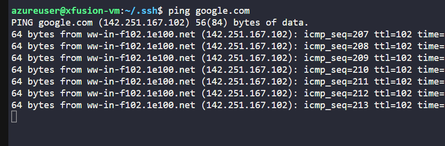
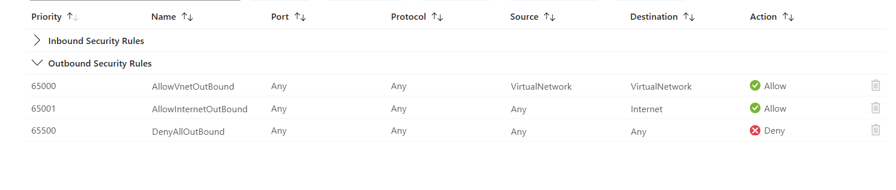

# Day 34: Enabling Internet Connectivity for Virtual Machines

## 🎯 Objective 
The Nautilus DevOps team has encountered an issue with an Azure VM named xfusion-vm. They are unable to install any packages on this VM due to connectivity issues. The team needs to identify the root cause of the problem and resolve it to restore normal operations.

Investigate the connectivity issue preventing package installation on the Azure VM xfusion-vm.
Implement a solution to resolve the connectivity issue and restore package installation capabilities on the VM.
Note: The SSH key required to access the Azure VM is already created and added to the VM's authorized keys. You can find the SSH key at /root/.ssh/id_rsa on the azure-client host.

## solution
To resolve the connectivity issue on the Azure VM xfusion-vm, follow these steps:
1. **Access the Azure VM**: Use SSH to connect to the xfusion-vm using the provided SSH key.
   ```bash
   ssh -i /root/.ssh/id_rsa azureuser@xfusion-vm-ip-address
   ```
   

2. **Check Network Configuration**: Once connected, check the network configuration to ensure that the VM has a valid IP address and is properly connected to the virtual network.
   ```bash
    ip addr show
    ```
3. **Check Internet Connectivity**: Test the internet connectivity by pinging a public DNS server or trying to access a website.
   ```bash
    ping 8.8.8.8
   ```






