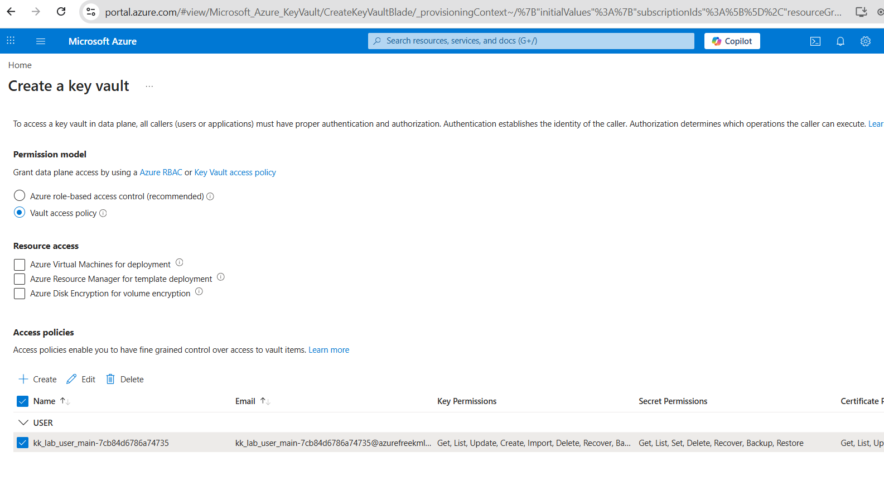

# Day 40: Managing Secrets with Azure Key Vault

## 🎯 Objective
The Nautilus DevOps team is focusing on improving their data security by using Azure Key Vault. Your task is to create a Key Vault with an RSA key and manage the encryption and decryption of a pre-existing sensitive file using this key.

Specific Requirements:

1. Create a Key Vault:

- Name the Key Vault xfusion-3810.
- Create the vault in the East US region.
- Use the Standard pricing tier.
- Set Soft Delete retention to 7 days.
- Use the Vault access policy permission model.
- Configure an access policy that allows Get, List, Encrypt, and - - - Decrypt permissions for the lab identity.

2. Create an RSA Key:

- Create a key named xfusion-key within the Key Vault.
- Key type: RSA.
- RSA key size: 4096.
- Leave all other settings as default.
- Encrypt the Sensitive Data:

3. Use the key to encrypt the provided SensitiveData.txt file (located in /root/) on the azure-client host.
- Use the RSA-OAEP algorithm.
- Base64 encode the plaintext before encryption.
- Save the encrypted version as EncryptedData.bin in the /root/ directory.

4. Verify Decryption:
- Decrypt EncryptedData.bin.
- Base64 decode the decrypted output.
- Save the result as DecryptedData.txt in /root/.
- Ensure the decrypted file matches the original SensitiveData.txt.
- Ensure that the Key Vault and key are correctly configured.


## encript secrets in Azure Key Vault and access them securely from your applications.

```bash
az keyvault key encrypt --vault-name <your-keyvault-name> --name <secret-name> --value "$(cat /root/secret.txt | base64)" --data-type base64 --algorithm RSA-OAEP --query "result" -o tsv > /root/encrypted-secret.txt
```

## Decrypt the secret when needed:

```bash
az keyvault key decrypt --vault-name <your-keyvault-name> --name <secret-name> --value "$(cat /root/encrypted-secret.txt)" --data-type base64 --algorithm RSA-OAEP --query "result" -o tsv | base64 --decode > /root/decrypted-secret.txt
```



## reference
https://learn.microsoft.com/en-us/cli/azure/keyvault/key?view=azure-cli-latest